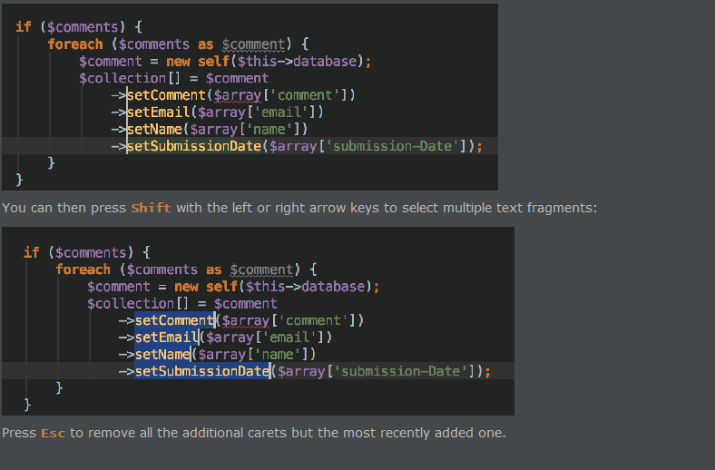

1. 
> In PhpStorm, you can have multiple carets. Having pressed Alt, click the left mouse button at the desired position to set additional cursors in the editor. Alternatively, press Ctrl (Alt on macOS) twice and hold the key, and then press the arrow keys.

> 在PhpStorm中，您可以拥有多个插入符号。按下Alt后，在所需位置单击鼠标左键以在编辑器中设置其他光标。或者，按两次Ctrl（Alt on macOS）并按住键，然后按箭头键。

