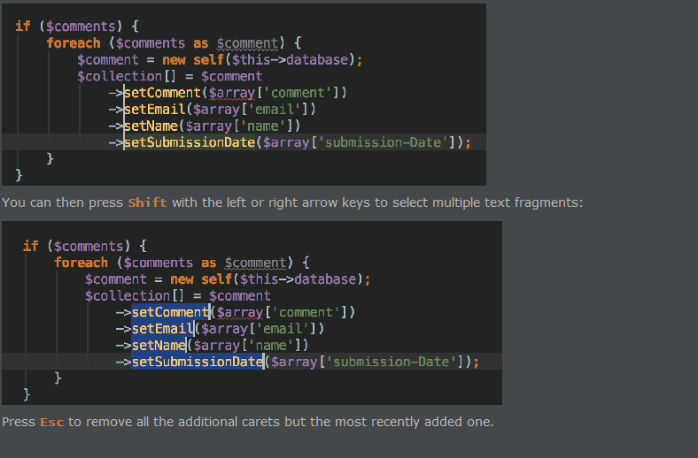
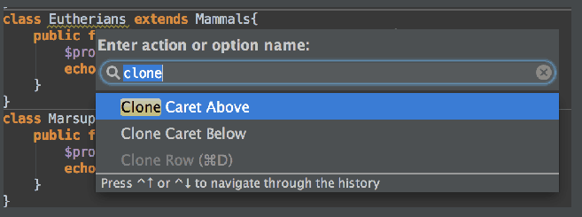
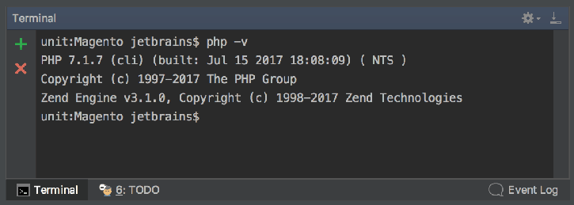
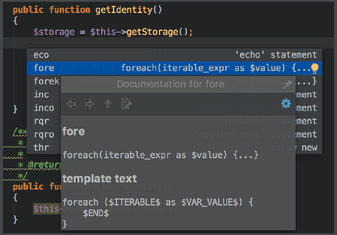
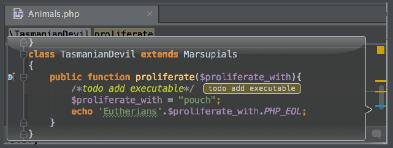
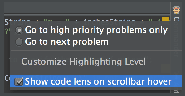

1.In PhpStorm, you can have multiple carets. Having pressed Alt, click the left mouse button at the desired position to set additional cursors in the editor. Alternatively, press Ctrl (Alt on macOS) twice and hold the key, and then press the arrow keys.

在PhpStorm中，您可以拥有多个插入符号。按下Alt后，在所需位置单击鼠标左键以在编辑器中设置其他光标。或者，按两次Ctrl（Alt on macOS）并按住键，然后按箭头键。

2.You can clone the caret strictly upwards or downwards. To do that, press Ctrl+Shift+A, type Clone caret, and then choose the desired action.

您可以严格向上或向下克隆插入符号。为此，请按Ctrl + Shift + A，键入克隆插入符号，然后选择所需的操作。

3.PhpStorm allows you to launch the embedded local terminal using the keyboard shortcut. Press Alt+F12, and see the terminal running.

PhpStorm允许您使用键盘快捷键启动嵌入式本地终端。按Alt + F12，查看终端是否正在运行。

4.When choosing a live template from a suggestion list, press Ctrl+Q to view quick documentation - to be sure you make a right choice:

从建议列表中选择实时模板时，按Ctrl + Q 查看快速文档 - 确保您做出正确的选择：

5.To make your printouts (File | Print) nice and informative, use keywords.
For example, use $DATE$ and $TIME$ to specify the exact date and time of the printout.

要使您的打印输出（文件|打印）美观且信息丰富，请使用关键字。
例如，使用$ DATE $和$ TIME $指定打印输出的确切日期和时间。

6.The chevron buttons    marking differences in the Differences viewer allow you to apply differences between panes.If you keep the Ctrl key pressed, the chevron buttons will change to   . Click one of these buttons to append contents of the current pane of the Differences viewer to the other pane.If you keep Shift pressed, the chevrons turn into  . Click this button to revert changes.

在差异查看器中标记差异的V形按钮允许您应用窗格之间的差异。如果按住Ctrl键，则V形按钮将变为。单击其中一个按钮，将差异查看器的当前窗格的内容附加到另一个窗格。如果你按住Shift键，那么V形变成了。单击此按钮可还原更改。

7.Hover your mouse pointer over a warning, error stripe or just some section of source code on the scroll bar outside of the scroll box, and you will see a lens:

将鼠标指针悬停在警告，错误条纹或滚动条外滚动条上的某些部分源代码上，您将看到一个镜头：

To disable the lens, clear the checkbox on the context menu of the code analysis marker:

要禁用镜头，请清除代码分析标记的上下文菜单上的复选框：

