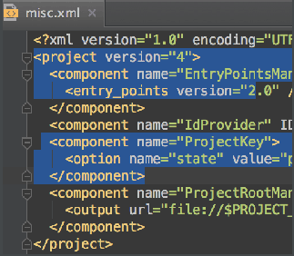
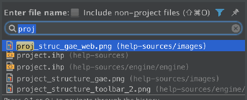
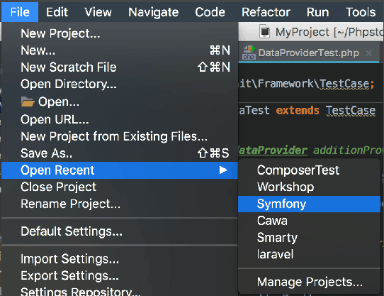
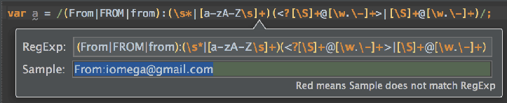

### 1-100

> 上面部分是系统提示，下面为翻译，可能有误，见谅。

1. In PhpStorm, you can have multiple carets. Having pressed Alt, click the left mouse button at the desired position to set additional cursors in the editor. Alternatively, press Ctrl (Alt on macOS) twice and hold the key, and then press the arrow keys.

在PhpStorm中，您可以拥有多个插入符号。按下Alt后，在所需位置单击鼠标左键以在编辑器中设置其他光标。或者，按两次Ctrl（Alt on macOS）并按住键，然后按箭头键。

2. You can clone the caret strictly upwards or downwards. To do that, press Ctrl+Shift+A, type Clone caret, and then choose the desired action.

您可以严格向上或向下克隆插入符号。为此，请按Ctrl + Shift + A，键入克隆插入符号，然后选择所需的操作。

3. PhpStorm allows you to launch the embedded local terminal using the keyboard shortcut. Press Alt+F12, and see the terminal running.

PhpStorm允许您使用键盘快捷键启动嵌入式本地终端。按Alt + F12，查看终端是否正在运行。

4. When choosing a live template from a suggestion list, press Ctrl+Q to view quick documentation - to be sure you make a right choice:

从建议列表中选择实时模板时，按Ctrl + Q 查看快速文档 - 确保您做出正确的选择：

5. To make your printouts (File | Print) nice and informative, use keywords.
For example, use $DATE$ and $TIME$ to specify the exact date and time of the printout.

要使您的打印输出（文件|打印）美观且信息丰富，请使用关键字。
例如，使用$ DATE $和$ TIME $指定打印输出的确切日期和时间。

6. The chevron buttons    marking differences in the Differences viewer allow you to apply differences between panes.If you keep the Ctrl key pressed, the chevron buttons will change to   . Click one of these buttons to append contents of the current pane of the Differences viewer to the other pane.If you keep Shift pressed, the chevrons turn into  . Click this button to revert changes.

在差异查看器中标记差异的V形按钮允许您应用窗格之间的差异。如果按住Ctrl键，则V形按钮将变为。单击其中一个按钮，将差异查看器的当前窗格的内容附加到另一个窗格。如果你按住Shift键，那么V形变成了。单击此按钮可还原更改。

7. Hover your mouse pointer over a warning, error stripe or just some section of source code on the scroll bar outside of the scroll box, and you will see a lens:

将鼠标指针悬停在警告，错误条纹或滚动条外滚动条上的某些部分源代码上，您将看到一个镜头：

To disable the lens, clear the checkbox on the context menu of the code analysis marker:

要禁用镜头，请清除代码分析标记的上下文菜单上的复选框：

8. To select multiple fragments in the "column mode", press and hold Control+Alt+Shift(on Windows and Linux) or Cmd+Alt+Shift(on macOS), and drag your mouse:

要在“列模式”中选择多个片段，请按住Control + Alt + Shift（在Windows和Linux上）或Cmd + Alt + Shift（在macOS上），然后拖动鼠标：

9. You can easily select multiple text fragments. To do that, keep Alt+Shift pressed and drag your mouse across the text:

您可以轻松选择多个文本片段。为此，请按住Alt + Shift并在文本上拖动鼠标：

10.  To select several words, press Alt, position the caret at each word to be selected and double-click the left mouse button.

要选择多个单词，请按Alt键，将插入符号放在要选择的每个单词上，然后双击鼠标左键。

11. You don't need to invoke quick documentation explicitly (Ctrl+Q) - if you hover your mouse pointer over the desired symbol, the quick documentation pop-up window will show automatically.
To enable this feature, select the Show quick documentation on mouse move checkbox on the Editor | General settings/preferences page.

您无需显式调用快速文档（Ctrl + Q） - 如果将鼠标指针悬停在所需符号上，则会自动显示快速文档弹出窗口。
要启用此功能，请在编辑器上选中“在鼠标移动时显示快速文档”复选框常规设置/首选项页面。

12. To view all the available scratch files, choose the Scratches view in the Project tool window.

要查看所有可用的临时文件，请在“项目”工具窗口中选择“划痕”视图。

13. You can hide the tool window buttons that you currently don't need.Right-click the tool window button you want to hide, and choose Remove from Sidebar on the context menu.

您可以隐藏当前不需要的工具窗口按钮。右键单击要隐藏的工具窗口按钮，然后从上下文菜单中选择“从侧栏中删除”。

14. To open any particular file in the editor quickly, press Ctrl+Shift+N (Navigate | File) and start typing its name. Choose a symbol from the lookup list that appears.

要快速打开编辑器中的任何特定文件，请按Ctrl + Shift + N（导航|文件）并开始键入其名称。从显示的查找列表中选择一个符号。

15. Pressing Alt+/ helps to complete words in the visible scope - so doing, the prototypes are highlighted.

按Alt + /有助于完成可见范围内的单词 - 这样做，原型会突出显示。

Use Alt+Shift+/ to do same in reverse order.

使用Alt + Shift + /以相反的顺序执行相同操作。

16. Use Analyze | Inspect Code to run code analysis for the whole project or a custom scope and examine the results in a convenient view.

使用 Analyze |Inspect Code 以运行整个项目或自定义范围的代码分析，并在方便的视图中检。

17. PhpStorm enables you to perform the following comparison types:
Compare directories
Compare a class or class member with another class or class member
Compare a local file with its versions in the Local History
Compare a local file with its current revision in your version control repository
Compare any local file with the file currently opened in the Editor
Compare any 2 local files to each other: text or binary
Compare selected text in the Editor with the clipboard contents
Use context menus to invoke comparison commands.
You can configure the usage of the differences tool on the Tools | Diff & merge settings/preferences page.

PhpStorm使您能够执行以下比较类型：
比较目录将类或类成员与另一个类或类成员进行比较将本地文件与其本地历史记录中的版本进行比较将本地文件与其版本控制存储库中的当前版本进行比较比较任何
包含当前在编辑器中打开的文件的本地文件将任意2个本地文件相互比较：文本或二进制文件将编辑器中的选定文本与剪贴板内容进行比较使用上下文菜单调用比较命令。
您可以在Tools |上配置差异工具的用法
差异和合并设置/首选项页面。

18. The Inline Variable refactoring replaces redundant variable usage with its last assigned value. To invoke the refactoring, move the caret over the local variable to apply the refactoring to. 

内联变量重构将冗余变量用法替换为其最后指定的值。要调用重构，请将插入符号移到局部变量上以应用重构。

...and press Ctrl+Alt+N (Refactor | Inline... ).
This will result in the following:

...然后按Ctrl + Alt + N（重构|内联...）。
这将导致以下结果：

19. To change the built-in web server port, in the Settings/Preferences dialog, expand the Build, Execution, Deployment node and select Debugger. Use the "Built-in server port" spin box to set the new value.

要更改内置Web服务器端口，请在“设置/首选项”对话框中，展开“构建，执行，部署”节点，然后选择“调试器”。使用“内置服务器端口”旋转框设置新值。

20. To reopen a recent project, select File | Reopen (on Windows and Linux) / File | Open Recent (on MacOS) on the main menu:

要重新打开最近的项目，请选择“文件”| 重新打开（在Windows和Linux上）/文件|在主菜单上打开最近（在MacOS上）：

Alternatively, right-click the PhpStorm icon on the task bar / Dock:

或者，右键单击任务栏/ Dock上的PhpStorm图标：

21. Code Completion lets you quickly complete different kinds of statements in the code. For example, start typing a class name and press Ctrl+空格 to complete it. When multiple choices are available, they are shown in the lookup list.

代码完成使您可以快速完成代码中的各种语句。例如，开始键入类名，然后按Ctrl +空格键完成它。当有多个选项可用时，它们会显示在查找列表中。

22. The format of a regular expression can be rather complicated. To make sure you didn't miss some slash or quotation mark, place the caret within the expression you want to check, and press Alt+Enter.In the pop-up frame type a sample string that should match your regular expression. If the background turns green, the match occurred. If it turns red, your expression probably contains a mistake.

正则表达式的格式可能相当复杂。要确保没有遗漏某些斜杠或引号，请将插入符号放在要检查的表达式中，然后按Alt+Enter。在弹出框架中键入应与正则表达式匹配的示例字符串。如果背景变为绿色，则表示匹配。如果它变成红色，表达式可能包含错误。

23. A special variant of the Code Completion feature invoked by pressing Ctrl+空格 twice allows you to complete XML tag names from namespaces not declared in the current file. If the namespace is not declared yet, the declaration is generated automatically.

通过按Ctrl +空格两次调用的代码完成功能的特殊变体允许您从未在当前文件中声明的名称空间中完成XML标记名称。如果尚未声明命名空间，则会自动生成声明。

24. You can quickly find all places where a particular class, method or variable is used in the whole project by positioning the caret at the symbol's name or at its usage in code and pressing Alt+F7 (Edit | Find | Find Usages).

通过将插入符号放在符号的名称或代码中的用法并按Alt + F7（编辑|查找|查找用法），可以快速找到整个项目中使用特定类，方法或变量的所有位置。

25. You can preview HTML files in a browser of your choice by clicking the browser icons toolbar:

If you just click the desired browser icon, the web server file URL opens:

如果只需单击所需的浏览器图标，则会打开Web服务器文件URL：

If you click the browser icon with the Shift key pressed, the local file URL opens instead:

如果在按下Shift键的情况下单击浏览器图标，则会打开本地文件URL：

26. You can add a brief description of any breakpoint to ease search in future.Press Ctrl+Shift+F8 to view all existing breakpoints, then right-click the breakpoint you want to provide a description for, and choose Edit description:

您可以添加任何断点的简短描述以方便将来搜索。按Ctrl + Shift + F8查看所有现有断点，然后右键单击要为其提供描述的断点，并选择编辑描述：

The provided description will help you find the breakpoint later:

提供的描述将帮助您以后找到断点：

27. To configure a remote PHP interpreter, open the Languages & Frameworks | PHP settings/preferences page.Then click the browse button, in the CLI Interpreters window click Add and choose the From Docker, Vagrant, VM, Remote... option.

要配置远程PHP解释器，请打开“语言和框架”|PHP设置/首选项页面。然后单击“浏览”按钮，在“CLI解释器”窗口中单击“添加”，然后选择“从Docker，Vagrant，VM，远程...”选项。

You can use this remote interpreter in your project, or leave it as one of the available interpreters.

您可以在项目中使用此远程解释器，或将其保留为可用的解释器之一。

28. You can quickly navigate in the currently edited file with Ctrl+F12 (Navigate | File Structure).File structure shows the list of members of the current class. Select an element you want to navigate to and press the Enter key or the F4 key.To easily locate an item in the list, simply start typing its name.

您可以使用Ctrl + F12（导航|文件结构）快速导航当前编辑的文件.File结构显示当前类的成员列表。选择要导航到的元素，然后按Enter键或F4键。要轻松找到列表中的项目，只需键入其名称即可。

29. You can avoid accidental moving of the tool window buttons or editor tabs by enabling Drag-n-Drop with ALT pressed only.

通过仅使用ALT启用Drag-n-Drop，可以避免意外移动工具窗口按钮或编辑器选项卡。

30.  You can easily rename your classes, methods and variables with automatic correction of all places where they are used.Place the caret at the symbol you want to rename, and press Shift+F6 (Refactor | Rename). Type the new name and press Enter.

您可以轻松地重命名您的类，方法和变量，并自动更正所有使用它们的位置。将插入符号放在要重命名的符号上，然后按Shift + F6（重构|重命名）。输入新名称，然后按Enter键。

Press Shift+F6 again to open the Rename dialog that will allow you to search for the provided text in comments and strings.

再次按Shift + F6打开“重命名”对话框，该对话框允许您在注释和字符串中搜索提供的文本。

31. PhpStorm allows to use multiselection while searching in a file (Ctrl+F). To add the next found occurrence to the selection, press Alt+J. Include all found occurrences into the selection by pressing Ctrl+Alt+Shift+J.

PhpStorm允许在文件中搜索时使用多选（Ctrl + F）。要将下一个找到的事件添加到选择中，请按Alt + J.按Ctrl + Alt + Shift + J将所有找到的事件包括在选择中。

32. You can edit both the opening and the closing tags in XML/HTML files simultaneously.Make sure to select the Simultaneous <tag></tag> editing checkbox in the Editor | General | Smart keys settings/preferences page.

您可以同时编辑XML / HTML文件中的开始和结束标记。确保在编辑器中选择Simultaneous <tag> </ tag>编辑复选框一般|智能键设置/首选项页面。

33. Use the Ctrl+Alt+Shift+U keyboard shortcut to open a UML class diagram in a new editor.

使用Ctrl + Alt + Shift + U键盘快捷键在新编辑器中打开UML类图。

34. Use the Ctrl+Alt+U keyboard shortcut to open a UML class diagram in a popup window.

使用Ctrl + Alt + U键盘快捷键在弹出窗口中打开UML类图。

35. You can execute injected SQL statements and the statements in SQL files by pressing Ctrl+Enter. (Alternatively, Alt+Enter | Run Query in Console.)

您可以按Ctrl + Enter执行注入的SQL语句和SQL文件中的语句。（或者，Alt + Enter |在控制台中运行查询。）

36. You can work with CSV, TSV and similar files as with text or a table.

您可以使用CSV，TSV和类似文件，如文本或表格。

37. You can compare data sources, schemas and tables. In the Database tool window, select two items that you want to compare and press Ctrl+D.

您可以比较数据源，模式和表。在“数据库”工具窗口中，选择要比较的两个项目，然后按Ctrl + D.

38. The Table Editor provides a GUI for working with table data. In the Database tool window, select the table of interest and press F4.

表编辑器提供了用于处理表数据的GUI。在“数据库”工具窗口中，选择感兴趣的表，然后按F4。

39. If you define your database as a data source, you'll get access to the database console, table editor, database diagrams and other useful features for working with databases.

如果将数据库定义为数据源，则可以访问数据库控制台，表编辑器，数据库图表以及使用数据库的其他有用功能。

40. rder not to update a database view manually, you can enable auto-synchronization for the corresponding data source (Data Source Properties in the context menu of the Database tool window).

为了不手动更新数据库视图，您可以为相应的数据源启用自动同步（数据库工具窗口的上下文菜单中的数据源属性）。

41. You can use colors to distinguish your data sources and their elements (Color Settings in the context menu of the Database tool window).

您可以使用颜色来区分数据源及其元素（“数据库”工具窗口的上下文菜单中的“颜色设置”）。

42.  If you have H2 or SQLite database files available locally, you can create data sources for them by dragging the files to the Database tool window. The files can be dragged from your file manager (e.g. Explorer or Finder), or from the Project tool window.

如果您在本地可以使用H2或SQLite数据库文件，则可以通过将文件拖到“数据库”工具窗口来为它们创建数据源。可以从文件管理器（例如Explorer或Finder）或“项目”工具窗口拖动文件。

43. To protect your database from accidental modifications in the Table Editor and the database console, you can turn on the Read-only option for the corresponding data source (Data Source Properties in the context menu of the Database tool window).

要保护数据库免受表编辑器和数据库控制台中的意外修改，可以打开相应数据源的“只读”选项（“数据库”工具窗口的上下文菜单中的“数据源属性”）。

44. To protect a table from accidental modifications in the Table Editor, you can make it read-only. To do that, click   in the lower-right corner of the workspace.

要保护表不被表编辑器中的意外修改，您可以将其设置为只读。为此，请单击工作区的右下角。

45. The Database tool window provides access to basic info about the database objects (Ctrl+Q).

数据库工具窗口提供对数据库对象基本信息的访问（Ctrl + Q）。

46. In the Transposed Row view (Ctrl+Q twice), the rows and columns are interchanged, and, for a row, the cells are shown one beneath the other.

在Transposed Row视图中（Ctrl + Q两次），行和列互换，对于一行，单元格显示在另一行之下。

47. The Value view for tables (Ctrl+Q) provides details about the values in the selected cells and also shows the info about related records.

表的值视图（Ctrl + Q）提供有关所选单元格中的值的详细信息，还显示有关相关记录的信息。

48. You can create data sources by importing database connection settings from the configuration files of the supported frameworks. In the context menu of the Database tool window, select New | Import from sources.

您可以通过从支持的框架的配置文件导入数据库连接设置来创建数据源。在“数据库”工具窗口的上下文菜单中，选择“新建”|从来源导入。

49. Smart completion in SQL (Ctrl+Shift+空格) is aware of columns types, and primary and foreign keys.

SQL中的智能完成（Ctrl + Shift +空格）可以识别列类型以及主键和外键。

50. To get better coding assistance for SQL, you should specify the SQL dialect that you are using (File | Settings | SQL Dialects or PhpStorm | Preferences | SQL Dialects).

要获得更好的SQL编码帮助，您应该指定您正在使用的SQL方言（文件|设置| SQL方言或PhpStorm |首选项| SQL方言）。

51. DDL data sources function nearly the same way as real databases and let you use coding assistance for SQL (even injected into the source code), as well as such features as database diagrams, comparison tools and more.

DDL数据源的功能与真实数据库几乎相同，并允许您使用SQL编码辅助（甚至注入源代码），以及数据库图表，比较工具等功能。

52. You can create DDL data sources by dragging DDL SQL files to the Database tool window. The files can be dragged from your file manager (e.g. Explorer or Finder), or from the Project tool window.

您可以通过将DDL SQL文件拖到数据库工具窗口来创建DDL数据源。可以从文件管理器（例如Explorer或Finder）或“项目”工具窗口拖动文件。

53. Database diagrams are available for data sources, schemas and tables. Press Ctrl+Alt+Shift+U to open a diagram in the editor.

数据库图表可用于数据源，模式和表。按Ctrl + Alt + Shift + U在编辑器中打开图表。

54. Database diagrams are available for data sources, schemas and tables. Press Ctrl+Alt+U to open a diagram in a pop-up.

数据库图表可用于数据源，模式和表。按Ctrl + Alt + U在弹出窗口中打开图表。

